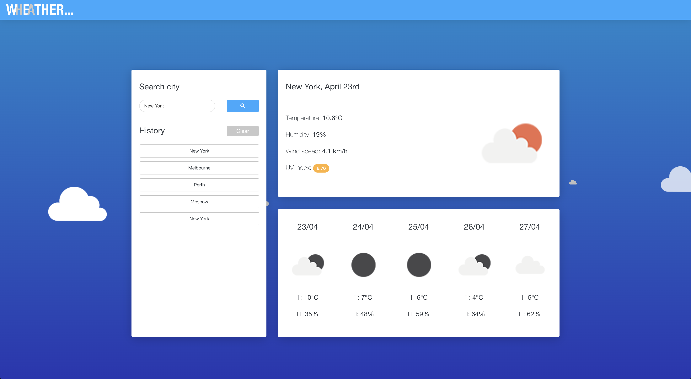
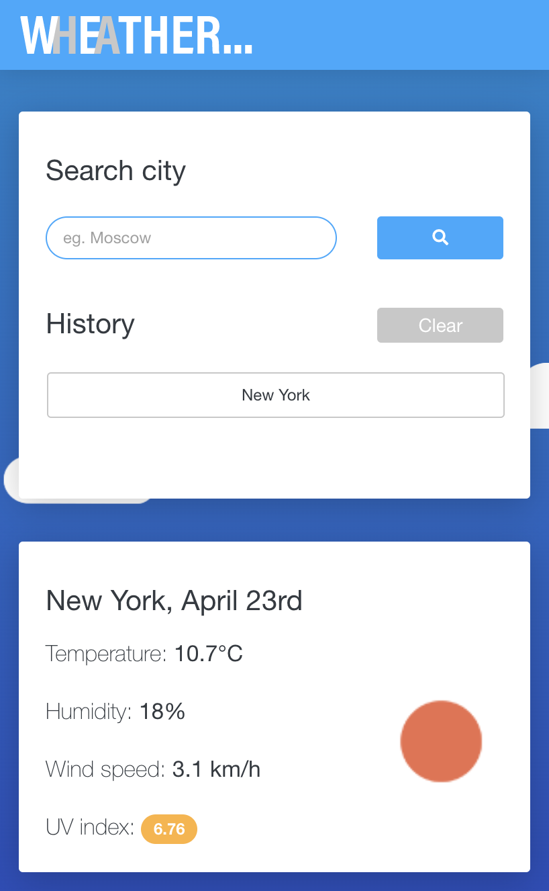

[contributors-shield]: https://img.shields.io/github/contributors/yours-kkuznets/Wheather-Forecast.svg?style=flat-square
[contributors-url]: https://github.com/yours-kkuznets/Wheather-Forecast/graphs/contributors
[forks-shield]: https://img.shields.io/github/forks/yours-kkuznets/Wheather-Forecast.svg?style=flat-square
[forks-url]: https://github.com/othneildrew/yours-kkuznets/Wheather-Forecast/network/members
[stars-shield]: https://img.shields.io/github/stars/yours-kkuznets/Wheather-Forecast.svg?style=flat-square
[stars-url]: https://github.com/yours-kkuznets/Wheather-Forecast/stargazers
[issues-shield]: https://img.shields.io/github/issues/yours-kkuznets/Wheather-Forecast.svg?style=flat-square
[issues-url]: https://github.com/yours-kkuznets/Wheather-Forecast/issues
[license-shield]: https://img.shields.io/github/license/yours-kkuznets/Wheather-Forecast.svg?style=flat-square
[license-url]: https://github.com/yours-kkuznets/Wheather-Forecast/blob/master/LICENSE.txt
[linkedin-shield]: https://img.shields.io/badge/-LinkedIn-black.svg?style=flat-square&logo=linkedin&colorB=555
[linkedin-url]: https://linkedin.com/in/yourskkuznets

[![Contributors][contributors-shield]][contributors-url] [![Forks][forks-shield]][forks-url] [![Stargazers][stars-shield]][stars-url] [![Issues][issues-shield]][issues-url] [![MIT License][license-shield]][license-url] [![LinkedIn][linkedin-shield]][linkedin-url]

# Custom CSS Portfolio

Mobile-first web application enabling users to view current weather and forecast for a selected city.

## Link to Application

Follow [this link](https://yours-kkuznets.github.io/Wheather-Forecast/) to view the application.

## Screenshots

### Desktop

### Mobile

## Getting Started

Clone the repository or download and unpack the source code of the project. From the project folder, open the `index.html` file with your preferred browser.

## Using Application

- Type in the city you want to see forecast for
- Search by pressing enter or clicking the `Search` button
- You will be presented with current information and weather forecast for the next 5 days on the right
- Your search history will be displayed unded the `History` section. To clear it, click on the `Clear` button

## Additional Information

- Depending on the current UV index for your searched city, it will be highlighted with different colours.
- If you search for a city and close the app, it saves your search history. When you open the app again, it will show weather information for the saved search

## Built With

- HTML5, CSS3, Javascript, jQuery, Bootstrap

- [Moment.js](https://momentjs.com/) - JavaScript date library

- [Axios](https://github.com/axios/axios) - Promise based HTTP client for the browser and node.js

- [NOW UI Kit](https://demos.creative-tim.com/now-ui-kit/index.html) - Bootstrap 4 UI kit

- [Favicon.io](https://favicon.io/) - Favicon generator

## Contributing

Please read [CONTRIBUTING.md](https://github.com/yours-kkuznets/Wheather-Forecast/blob/master/CONTRIBUTING.md) for details on the code of conduct, and the process for submitting pull requests.

## Authors

- **Kirill Kuznetsov** - [yours-kkuznets](https://github.com/yours-kkuznets)

## License

This project is licensed under the MIT License - see the [LICENSE.txt](https://github.com/yours-kkuznets/Wheather-Forecast/blob/master/LICENSE.txt) file for details

## Acknowledgments

- Shaw - [shshaw](https://codepen.io/shshaw) - For [animated clouds background](https://codepen.io/shshaw/pen/DxJka) template.

* Billie Thompson - [PurpleBooth](https://gist.github.com/PurpleBooth) - For [README.md](https://gist.github.com/PurpleBooth/109311bb0361f32d87a2) and [CONTRIBUTING.md](https://gist.github.com/PurpleBooth/b24679402957c63ec426) templates.
